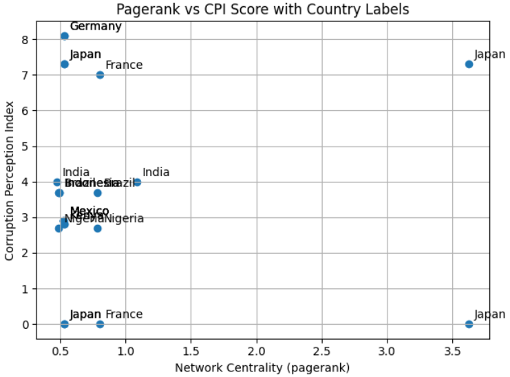

# Causal and Network Analysis of Government Procurement Data with Corruption Perception Indices

This project investigates how structural features of government procurement networks—such as firm centrality and deal concentration—affect national corruption scores (e.g., CPI). It utilizes distributed processing (PySpark), graph databases (Neo4j), causal inference (DoWhy) to uncover underlying mechanisms of corruption.

---

## Technologies Used

| Technology      | Purpose                                          |
|------------------|--------------------------------------------------|
| PySpark          | Preprocessing large-scale procurement data       |
| Neo4j Desktop  | Constructing procurement network and calculating centrality |
| DoWhy   | Causal inference between network structure and corruption |

---

## Project Structure
```bash
corruption-net-causal/
├── data/
│ ├── contracts.json # Procurement data (Dummy data)
│ └── corruption_scores.csv # Country-level corruption scores
├── spark/
│ └── process_contracts.py # PySpark processing script
├── results/
│ └── supplier_degree.csv # Neo4j output
├── notebooks/
│ └── causal_analysis.ipynb # Causal inference notebook (Colab-compatible)
├── README.md # This file
└── requirements.txt # Python package list
```
Country-level corruption scores data source: [corruption-perceptions-index](https://github.com/datasets/corruption-perceptions-index/blob/cpi-dataflows/data/cpi.csv)




<br>Contribution: Analyzed how an increase in a firm's network centrality could affect the risk of corruption.
<br>Note that the contract data used in this project is synthetic.
